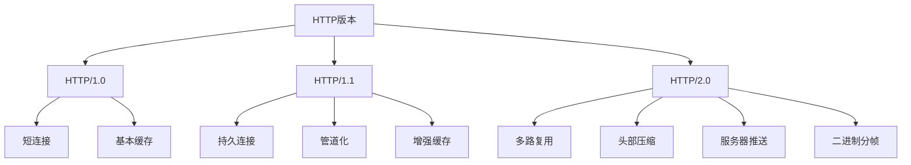

# 面试问题
什么叫线程安全

Java里面有哪些基本类型，对应的包装类有哪些

什么场景下使用包装类

包装类线程安全吗？ 

除了不能修改值，还不能修改什么 

String中split方法不是修改String，为啥能保证线程安全

线程池的参数

创建线程时，是优先把线程最大数放满还是优先放入队列 

IO密集型，如何设置参数保证效率最大 

如何保证核心线程不会销毁

Java中pojo是否要重写hashcode和equal方法，哪些情况下需要重写

除了判断相等情况下重写，不比较有必要重写嘛

数组length和字符串length有啥区别？ 

数组里面元素如何存储的

讲讲Java里面的反射

classloader和class的区别，两个都可以加载类 

介绍一下单例模型，什么场景下会用这个

说下Java里面最简单的单例实现 

HTTP/1.0、HTTP/1.1、HTTP/2.0 有什么区别

怎么基于 TCP 实现 HTTP，用 Java 代码怎么写（X）

Java 网络编程 Socket，代码怎么写（X）

讲讲数据库里面的ACID

讲讲事务隔离级别

不同隔离级别下有哪些锁

为啥加了间隙锁能避免幻读

<font style="color:rgb(51,51,51);background-color:rgb(255,255,255);">用你能想到的Java技术栈实现一个本地mysql增删改事务那些</font>

有千万级别数据表，里面有一个自增ID和int的年龄，如何建索引比较合适

数据库里面应该放常变化的字段嘛

年龄应该放入数据库表里面嘛 

事务传播机制 

默认的传播机制是啥 

并发事务修改怎么解决的？写 Java 代码还是数据库自己解决

# 参考回答
## 线程安全
**「面试官」**：什么叫线程安全？

**「参考回答」**：

线程安全指的是在多线程环境下，代码能够正确地处理多个线程同时访问共享资源，而不会出现数据不一致或者错误的情况。线程安全的代码能够保证在并发执行时仍然保持正确性。

具体表现为：

+ 多个线程同时执行时，程序的行为是可预测的
+ 多个线程不会相互干扰或破坏彼此的数据
+ 共享资源的状态始终保持一致和正确

实现线程安全的方法包括：

+ 使用同步机制（如synchronized关键字）
+ 使用线程安全的数据结构（如ConcurrentHashMap）
+ 使用原子操作（如AtomicInteger）
+ 使用线程本地存储（ThreadLocal）

## Java基本类型和包装类
**「面试官」**：Java里面有哪些基本类型，对应的包装类有哪些？

**「参考回答」**：

Java中有8种基本数据类型，每种都有对应的包装类：

1. **基本类型**：
    - byte（8位）
    - short（16位）
    - int（32位）
    - long（64位）
    - float（32位）
    - double（64位）
    - boolean
    - char（16位）
1. **对应的包装类**：
    - Byte
    - Short
    - Integer
    - Long
    - Float
    - Double
    - Boolean
    - Character

这些包装类都位于java.lang包中，它们将基本数据类型包装成对象，使其可以在需要对象的场合使用。

## 包装类使用场景
**「面试官」**：什么场景下使用包装类？

**「参考回答」**：

包装类在以下场景中特别有用：

1. **泛型使用**：
    - Java泛型不支持基本类型，必须使用包装类。  
例如：`List<Integer>` 而不是 `List<int>`
1. **作为对象使用**：
    - 在需要将基本类型当作对象处理的场合。  
例如：将基本类型存储在集合中。
1. **null值表示**：
    - 基本类型不能表示null，而包装类可以。  
这在数据库操作中特别有用。
1. **类型转换**：
    - 利用包装类提供的方法进行类型转换。  
例如：`Integer.parseInt(String)`
1. **常量和工具方法**：
    - 使用包装类提供的常量和工具方法。  
例如：`Integer.MAX_VALUE`, `Double.isNaN()`
1. **反射**：
    - 在反射API中使用，因为反射操作的都是对象。
1. **序列化**：
    - 在某些序列化场景中，可能需要使用包装类。
1. **多线程环境**：
    - 使用原子包装类（如AtomicInteger）来确保线程安全。

## 包装类的线程安全性
**「面试官」**：包装类线程安全吗？

**「参考回答」**：

包装类的线程安全性需要分情况讨论：

1. **不可变性**：
    - 大多数包装类（如Integer, Long, Float, Double, Boolean, Character）是不可变的（immutable）。
    - 不可变对象天然是线程安全的，因为其状态不能被修改。
1. **静态工具方法**：
    - 一些静态方法如`Integer.valueOf()`使用了缓存机制，可能在高并发情况下存在线程安全问题。
    - 但这通常不会影响正确性，只可能影响性能。
1. **原子操作**：
    - 包装类不提供原子操作。对于需要原子操作的场景，应使用`java.util.concurrent.atomic`包中的类，如`AtomicInteger`。
1. **可变操作**：
    - 包装类的可变操作（如`Integer.parseInt()`）是无状态的，因此是线程安全的。
1. **缓存池**：
    - 某些包装类（如Integer）维护了一个缓存池，这个缓存池本身是线程安全的。

总的来说，包装类的核心功能是线程安全的，但在特定的使用场景下（如频繁装箱、拆箱操作），可能需要额外的同步措施来确保线程安全。

## 包装类的不可变性
**「面试官」**：除了不能修改值，还不能修改什么？

**「参考回答」**：

对于Java的包装类，除了不能修改其值，还有以下几点不可变特性：

1. **内部状态**：
    - 所有的字段都是final的，意味着一旦对象被创建，其内部状态就不能被改变。
1. **引用的对象**：
    - 如果包装类内部有引用其他对象，这些被引用的对象也应该是不可变的。  
（不过在基本包装类中，这种情况并不常见）
1. **方法**：
    - 所有的方法都不能修改对象的状态。它们要么返回新的对象，要么返回原始值。
1. **子类化**：
    - 这些类通常被声明为final，防止被继承和重写方法。
1. **hashCode**：
    - hashCode方法返回的值在对象生命周期内应该保持不变。
1. **序列化**：
    - 即使在序列化和反序列化过程中，对象的状态也不应该改变。

举例说明：

```java
Integer a = 5;
// 以下操作不会改变a的值，而是创建新的对象
Integer b = a + 1;  // b是新的对象，值为6
a++;  // 这实际上创建了一个新的Integer对象
```

这种不可变性保证了包装类对象在多线程环境中的安全性，但也意味着在需要频繁修改值的场景下可能会产生大量的临时对象。

## String的线程安全性
**「面试官」**：String中split方法不是修改String，为啥能保证线程安全？

**「参考回答」**：

String的`split`方法之所以能保证线程安全，主要基于以下几个原因：

1. **不可变性**：
    - String是不可变的。`split`方法不会修改原始String对象。
1. **新对象创建**：
    - `split`方法返回一个新的String数组，而不是修改原String。
1. **无状态操作**：
    - `split`是一个无状态的操作，它不依赖于任何共享的可变状态。
1. **线程封闭**：
    - 方法的参数和局部变量是线程封闭的，每个线程都有自己的栈空间。
1. **函数式操作**：
    - `split`可以被视为一个纯函数，对于相同的输入总是产生相同的输出。

示例代码：

```java
public class StringSplitExample {
    public static void main(String[] args) {
        final String sharedString = "a,b,c,d";

        Runnable task = () -> {
            String[] parts = sharedString.split(",");
            System.out.println(Thread.currentThread().getName() + ": " + Arrays.toString(parts));
        };

        // 创建多个线程同时调用split方法
        for (int i = 0; i < 5; i++) {
            new Thread(task).start();
        }
    }
}
```

在这个例子中，即使多个线程同时调用`split`方法，也不会导致线程安全问题。每个线程都会得到自己的`String`数组，不会相互干扰。

总之，`String.split()`方法的线程安全性源于String的不可变性和方法的无状态特性，而不是因为它不修改String。实际上，正是因为它不修改原String，而是返回新的对象，才能保证线程安全。

## 线程池参数
**「面试官」**：线程池的参数有哪些？

**「参考回答」**：

Java中，使用`ThreadPoolExecutor`创建线程池时，主要涉及以下参数：

1. **corePoolSize**（核心线程数）：
    - 线程池中保持活跃的线程数，即使它们处于空闲状态。
1. **maximumPoolSize**（最大线程数）：
    - 线程池中允许的最大线程数。
1. **keepAliveTime**（空闲线程存活时间）：
    - 当线程数大于核心线程数时，多余的空闲线程在终止前等待新任务的最长时间。
1. **unit**（时间单位）：
    - `keepAliveTime`参数的时间单位。
1. **workQueue**（工作队列）：
    - 用于保存等待执行的任务的阻塞队列。
    - 常用的有ArrayBlockingQueue、LinkedBlockingQueue、SynchronousQueue等。
1. **threadFactory**（线程工厂）：
    - 用于创建新线程的工厂。
    - 可以用来设置线程名称、优先级等。
1. **handler**（拒绝策略）：
    - 当线程池和队列都满了，新提交的任务的处理策略。
    - 常用的有AbortPolicy、CallerRunsPolicy、DiscardPolicy、DiscardOldestPolicy。

示例代码：

```java
ThreadPoolExecutor executor = new ThreadPoolExecutor(
    5,                      // corePoolSize
    10,                     // maximumPoolSize
    60L,                    // keepAliveTime
    TimeUnit.SECONDS,       // unit
    new LinkedBlockingQueue<Runnable>(),  // workQueue
    Executors.defaultThreadFactory(),     // threadFactory
    new ThreadPoolExecutor.AbortPolicy()  // handler
);
```

这些参数的合理配置对线程池的性能和行为有重要影响。需要根据具体的应用场景和需求来调整这些参数。

## 线程池的任务分配策略
**「面试官」**：创建线程时，是优先把线程最大数放满还是优先放入队列？

**「参考回答」**：

线程池在分配任务时遵循以下策略：

1. **优先使用核心线程**：
    - 如果当前运行的线程数小于corePoolSize，创建新线程来执行任务。
1. **其次放入队列**：
    - 如果运行的线程数等于或大于corePoolSize，将任务放入队列。
1. **队列满则创建新线程**：
    - 如果队列已满，且运行的线程数小于maximumPoolSize，创建新线程。
1. **超出最大线程数则执行拒绝策略**：
    - 如果队列已满，且运行的线程数等于maximumPoolSize，执行拒绝策略。

因此，线程池**优先放入队列**，而不是优先把线程最大数放满。只有当队列满了，才会考虑创建超过核心线程数的新线程。

这种策略的优点：

+ 控制资源的使用
+ 避免创建过多线程导致的系统开销
+ 在负载增加时能够平滑地扩展线程数

示意图：


这种设计允许线程池在负载较轻时保持较小的线程数，在负载增加时逐步增加线程数，从而在资源利用和性能之间取得平衡。

## IO密集型任务的线程池配置
**「面试官」**：IO密集型，如何设置参数保证效率最大？

**「参考回答」**：

对于IO密集型任务，线程池的配置策略与CPU密集型任务不同。IO密集型任务的特点是线程大部分时间在等待IO操作完成，而不是占用CPU。因此，可以采用以下策略来最大化效率：

1. **核心线程数（corePoolSize）和最大线程数（maximumPoolSize）**：
    - 可以设置得相对较高，通常远超CPU核心数。
    - 一个常用的经验公式是：线程数 = CPU核心数 * (1 + 等待时间/计算时间)
    - 对于纯IO密集型任务，可以考虑设置为CPU核心数的2倍甚至更高。
1. **队列**：
    - 使用有界队列，如ArrayBlockingQueue。
    - 队列容量可以设置得相对较小，以促进创建更多的线程。
1. **keepAliveTime**：
    - 可以设置得相对较短，以便及时回收空闲线程。
1. **拒绝策略**：
    - 可以使用CallerRunsPolicy，在线程池满载时，将任务回退到调用者的线程执行。

示例配置：

```java
int corePoolSize = Runtime.getRuntime().availableProcessors() * 2;
int maximumPoolSize = corePoolSize * 2;
long keepAliveTime = 60L;
TimeUnit unit = TimeUnit.SECONDS;
BlockingQueue<Runnable> workQueue = new ArrayBlockingQueue<>(500);
ThreadFactory threadFactory = Executors.defaultThreadFactory();
RejectedExecutionHandler handler = new ThreadPoolExecutor.CallerRunsPolicy();

ThreadPoolExecutor executor = new ThreadPoolExecutor(
    corePoolSize,
    maximumPoolSize,
    keepAliveTime,
    unit,
    workQueue,
    threadFactory,
    handler
);
```

1. **动态调整**：
    - 可以使用ThreadPoolExecutor的方法动态调整参数：
        * `setCorePoolSize()`
        * `setMaximumPoolSize()`
    - 根据实际负载情况进行调整。
1. **监控**：
    - 实施监控机制，观察线程池的性能指标。
    - 关注队列大小、活跃线程数、完成任务数等指标。
1. **考虑使用虚拟线程**：
    - 如果使用Java 19+，可以考虑使用虚拟线程，它们特别适合IO密集型任务。

```java
ExecutorService executor = Executors.newVirtualThreadPerTaskExecutor();
```

1. **避免线程饥饿**：
    - 确保IO操作不会长时间阻塞线程，考虑使用异步IO。
1. **合理的任务粒度**：
    - 将大型IO任务分解成适当大小的子任务，以提高并行度。

通过这些策略，可以最大化IO密集型任务的处理效率，充分利用系统资源，同时避免过度消耗资源。需要注意的是，最佳配置往往需要通过实际测试和调优来确定。

## 保证核心线程不会销毁
**「面试官」**：如何保证核心线程不会销毁？

**「参考回答」**：

要保证核心线程不会被销毁，可以采取以下几种方法：

1. **设置allowCoreThreadTimeOut为false**：

```java
ThreadPoolExecutor executor = new ThreadPoolExecutor(/* 参数 */);
executor.allowCoreThreadTimeOut(false);  // 默认就是false
```

    - 这是ThreadPoolExecutor的默认行为。
    - 核心线程即使在空闲状态下也不会被回收。
1. **将keepAliveTime设置为0或很大的值**：

```java
long keepAliveTime = Long.MAX_VALUE;
TimeUnit unit = TimeUnit.NANOSECONDS;
```

    - 即使allowCoreThreadTimeOut为true，也可以通过设置很长的存活时间来保持核心线程。
1. **使用预启动所有核心线程**：

```java
executor.prestartAllCoreThreads();
```

    - 确保所有核心线程在需要之前就已创建。
1. **保持任务队列非空**：

```java
ScheduledExecutorService scheduler = Executors.newScheduledThreadPool(1);
scheduler.scheduleAtFixedRate(() -> {
    executor.submit(() -> {
        // 心跳任务
    });
}, 0, 1, TimeUnit.MINUTES);
```

    - 可以周期性地提交一些"心跳"任务来保持核心线程活跃。
1. **自定义ThreadFactory**：

```java
ThreadFactory threadFactory = new ThreadFactory() {
    @Override
    public Thread newThread(Runnable r) {
        Thread t = new Thread(r);
        t.setDaemon(true);
        return t;
    }
};
```

    - 创建守护线程（Daemon Thread）作为核心线程。
1. **使用固定大小的线程池**：

```java
ExecutorService executor = Executors.newFixedThreadPool(nThreads);
```

    - 如Executors.newFixedThreadPool()，其核心线程数等于最大线程数。
1. **重写ThreadPoolExecutor**：

```java
class MyThreadPoolExecutor extends ThreadPoolExecutor {
    @Override
    protected void afterExecute(Runnable r, Throwable t) {
        super.afterExecute(r, t);
        // 重置线程最后活动时间
    }
}
```

    - 覆盖afterExecute或beforeExecute方法，在其中重置线程的最后活动时间。

通过这些方法，可以确保核心线程在线程池的整个生命周期内保持活跃状态。选择哪种方法取决于具体的应用场景和需求。需要注意的是，保持过多的空闲线程可能会浪费系统资源，因此应该根据实际需求来权衡。

## Java POJO的hashCode和equals方法
**「面试官」**：Java中pojo是否要重写hashcode和equal方法，哪些情况下需要重写？

**「参考回答」**：

在Java中，是否需要为POJO（Plain Old Java Object）重写hashCode()和equals()方法，取决于这个POJO的用途和在程序中的角色。一般来说，以下情况需要考虑重写这两个方法：

1. **使用哈希基础的集合**：
    - 当POJO被用作HashMap、HashSet等基于哈希的集合的键时。
    - 这些集合使用hashCode()来确定对象的存储位置，使用equals()来比较对象。
1. **对象比较**：
    - 当需要比较两个POJO对象的内容而不是引用时。
    - 默认的equals()方法只比较对象引用。
1. **缓存**：
    - 在实现缓存机制时，常常需要使用对象的hashCode作为缓存key。
1. **保持一致性**：
    - 如果重写了equals()，通常也应该重写hashCode()，反之亦然。
    - 这是为了保持Java的一般约定：相等的对象必须有相同的哈希码。
1. **业务逻辑需求**：
    - 当对象的相等性在业务逻辑中有特定的定义时。
1. **持久化**：
    - 在某些ORM框架中，可能需要重写这些方法以支持实体的正确比较和检索。

示例代码：

```java
public class Person {
    private String name;
    private int age;

    // 构造函数，getter和setter省略

    @Override
    public boolean equals(Object o) {
        if (this == o) return true;
        if (o == null || getClass() != o.getClass()) return false;
        Person person = (Person) o;
        return age == person.age && Objects.equals(name, person.name);
    }

    @Override
    public int hashCode() {
        return Objects.hash(name, age);
    }
}
```

需要注意的是：

+ 重写equals()时，应确保它是等价关系（自反性、对称性、传递性）。
+ hashCode()方法应该尽可能均匀地散列对象。
+ 如果一个类是不可变的，可以缓存hashCode的值以提高性能。

不重写这些方法的情况：

+ 当对象的身份（引用相等性）比其状态更重要时。
+ 当类是抽象的，且其子类更适合定义相等性时。
+ 当确定该类的实例永远不会被用在需要这些方法的上下文中时。

总的来说，是否重写这些方法应该基于类的设计意图和使用场景来决定。

## 重写hashCode和equals的其他情况
**「面试官」**：除了判断相等情况下重写，不比较有必要重写嘛？

**「参考回答」**：

除了用于对象相等性比较，还有一些其他情况下重写`hashCode()`和`equals()`方法可能是有益的或必要的：

1. **自定义排序**：
    - 虽然`Comparable`接口通常用于排序，但有时`equals()`方法的实现可以影响排序的稳定性。
1. **日志和调试**：
    - 重写这些方法可以提供更有意义的对象表示，便于日志记录和调试。
1. **序列化和反序列化**：
    - 在某些序列化框架中，这些方法可能影响对象的序列化和反序列化行为。
1. **对象池和缓存优化**：
    - 即使不直接用于比较，自定义的`hashCode()`可以改善对象池或缓存的性能。
1. **框架兼容性**：
    - 某些框架可能依赖这些方法的特定实现，即使不直接用于比较。
1. **测试断言**：
    - 在单元测试中，自定义的`equals()`可以使断言更加精确。
1. **对象状态验证**：
    - `equals()`方法可以用作一种复杂的状态验证机制。
1. **数据一致性**：
    - 在分布式系统中，这些方法可能用于确保数据一致性。

示例代码（用于日志和调试）：

```java
public class ComplexObject {
    private String id;
    private Map<String, Object> properties;

    // 构造函数等省略

    @Override
    public boolean equals(Object o) {
        if (this == o) return true;
        if (o == null || getClass() != o.getClass()) return false;
        ComplexObject that = (ComplexObject) o;
        return Objects.equals(id, that.id) &&
               Objects.equals(properties, that.properties);
    }

    @Override
    public int hashCode() {
        return Objects.hash(id, properties);
    }

    @Override
    public String toString() {
        return "ComplexObject{" +
               "id='" + id + '\'' +
               ", properties=" + properties +
               '}';
    }
}
```

在这个例子中，重写这些方法不仅用于比较，还提供了更好的日志和调试支持。

然而，需要注意的是：

+ 不必要的重写可能会增加代码复杂性。
+ 在不需要的情况下重写这些方法可能会导致意外的行为或性能问题。
+ 应该根据类的具体用途和上下文来决定是否重写这些方法。

总的来说，虽然有些情况下重写这些方法可能带来额外的好处，但如果没有明确的需求，保持默认实现通常是更安全和简单的选择。

## 数组length和字符串length的区别
**「面试官」**：数组length和字符串length有啥区别？

**「参考回答」**：

数组的`length`和字符串的`length()`虽然都用于获取长度，但它们有几个关键的区别：

1. **语法形式**：

```java
int[] array = new int[5];
int arrayLength = array.length;

String str = "Hello";
int strLength = str.length();
```

    - 数组：`length`是一个属性（field）。
    - 字符串：`length()`是一个方法。
1. **可变性**：
    - 数组：`length`是final的，创建后不可改变。
    - 字符串：`length()`返回当前字符串的长度，字符串本身是不可变的。
1. **性能**：
    - 数组：访问`length`是常量时间操作，非常快。
    - 字符串：`length()`方法虽然也很快，但理论上比数组的`length`慢一点点。
1. **空值处理**：
    - 数组：如果数组为null，访问`length`会抛出NullPointerException。
    - 字符串：如果字符串为null，调用`length()`也会抛出NullPointerException。
1. **底层实现**：
    - 数组：`length`是数组对象的一部分，在创建时就确定。
    - 字符串：`length()`方法实际上返回内部字符数组的长度。
1. **用途**：
    - 数组：主要用于循环遍历或检查数组大小。
    - 字符串：除了获取长度，还常用于字符串操作和验证。
1. **编译时常量**：
    - 数组：`length`不是编译时常量。
    - 字符串：字面量的`length()`可以在编译时确定。

示例代码：

```java
public class LengthExample {
    public static void main(String[] args) {
        // 数组length
        int[] numbers = {1, 2, 3, 4, 5};
        System.out.println("Array length: " + numbers.length);

        // 字符串length()
        String text = "Hello, World!";
        System.out.println("String length: " + text.length());

        // 编译时常量
        final String constant = "Constant";
        System.out.println("Constant length: " + constant.length());

        // 空值处理
        String nullString = null;
        try {
            System.out.println(nullString.length());  // 抛出NullPointerException
        } catch (NullPointerException e) {
            System.out.println("NullPointerException caught");
        }
    }
}
```

理解这些区别对于正确使用和优化Java代码很重要，特别是在处理大量数据或性能敏感的应用中。

## 数组元素的存储方式
**「面试官」**：数组里面元素如何存储的？

**「参考回答」**：

数组在Java中是一种基本的数据结构，其元素的存储方式有以下特点：

1. **连续内存空间**：
    - 数组元素在内存中是连续存储的。
    - 这允许通过基址（数组的起始地址）和偏移量快速访问任何元素。
1. **固定大小**：
    - 数组创建后，其大小就固定了，不能动态增加或减少。
    - 这意味着内存分配是一次性完成的。
1. **类型一致性**：
    - 同一数组中的所有元素类型必须相同。
    - 这保证了每个元素占用相同的内存空间。
1. **索引访问**：
    - 可以通过索引直接访问任何元素，时间复杂度为O(1)。
    - 索引从0开始，到length-1结束。
1. **内存布局**：
    - 对于基本类型数组，元素直接存储在数组中。
    - 对于对象数组，存储的是对象的引用（地址）。
1. **多维数组**：
    - 在Java中，多维数组实际上是"数组的数组"。
    - 每个维度可能有不同的长度（不规则数组）。
1. **内存对齐**：
    - 为了优化访问速度，数组元素通常会按照特定的字节边界对齐。
1. **堆内存分配**：
    - 数组对象本身（包括length属性）存储在堆内存中。

示例代码：

```java
public class ArrayStorageExample {
    public static void main(String[] args) {
        // 基本类型数组
        int[] numbers = new int[5];
        for (int i = 0; i < numbers.length; i++) {
            numbers[i] = i * 10;
        }

        // 对象数组
        String[] words = new String[3];
        words[0] = "Hello";
        words[1] = "World";
        words[2] = "!";

        // 多维数组
        int[][] matrix = new int[3][];
        matrix[0] = new int[2];
        matrix[1] = new int[3];
        matrix[2] = new int[4];

        // 打印数组信息
        System.out.println("Numbers: " + Arrays.toString(numbers));
        System.out.println("Words: " + Arrays.toString(words));
        System.out.println("Matrix: " + Arrays.deepToString(matrix));
    }
}
```

内存示意图：

```plain
基本类型数组 (numbers):
+---+---+---+---+---+
| 0 |10 |20 |30 |40 |
+---+---+---+---+---+

对象数组 (words):
+--------+--------+--------+
| [引用] | [引用] | [引用] |
+--------+--------+--------+
    |        |        |
    v        v        v
 "Hello"  "World"    "!"

多维数组 (matrix):
+--------+--------+--------+
| [引用] | [引用] | [引用] |
+--------+--------+--------+
    |        |        |
    v        v        v
 +---+---+ +---+---+---+ +---+---+---+---+
 | 0 | 0 | | 0 | 0 | 0 | | 0 | 0 | 0 | 0 |
 +---+---+ +---+---+---+ +---+---+---+---+
```

理解数组的存储方式对于有效使用数组、优化性能以及理解某些数组操作的行为非常重要。例如，知道数组元素是连续存储的，可以解释为什么数组的随机访问非常快，而在数组中间插入或删除元素则相对较慢。

## Java反射
**「面试官」**：讲讲Java里面的反射。

**「参考回答」**：

Java反射是一种强大的特性，允许程序在运行时检查、修改程序的结构和行为。它提供了在运行时访问和操作类、接口、字段和方法的能力，即使在编译时不知道这些元素的名称。

**反射的主要功能**：

1. **检查类的结构**：
    - 获取类的方法、字段、构造器等信息。
1. **创建对象实例**：
    - 使用Constructor类的newInstance()方法。
1. **调用方法**：
    - 使用Method类的invoke()方法。
1. **访问和修改字段**：
    - 使用Field类的get()和set()方法。
1. **检查注解**：
    - 在运行时读取注解信息。

**主要类**：

+ `Class`：代表类的实体，在运行的Java应用程序中表示类和接口。
+ `Method`：代表类的方法。
+ `Field`：代表类的成员变量。
+ `Constructor`：代表类的构造方法。

**反射的使用示例**：

```java
public class ReflectionExample {
    public static void main(String[] args) throws Exception {
        // 获取类的Class对象
        Class<?> clazz = Class.forName("java.util.ArrayList");

        // 创建实例
        Object list = clazz.getDeclaredConstructor().newInstance();

        // 获取方法
        Method addMethod = clazz.getMethod("add", Object.class);

        // 调用方法
        addMethod.invoke(list, "Hello");
        addMethod.invoke(list, "Reflection");

        // 获取字段
        Field sizeField = clazz.getDeclaredField("size");
        sizeField.setAccessible(true);

        // 读取字段值
        int size = (int) sizeField.get(list);

        System.out.println("Size: " + size);
        System.out.println("List: " + list);
    }
}
```

**反射的优点**：

+ 增加程序的灵活性和通用性。
+ 支持动态加载类和使用类信息。
+ 有助于创建灵活的框架。

**反射的缺点**：

+ 性能开销：反射操作的性能较低。
+ 安全限制：反射可能会破坏封装性。
+ 代码可读性降低。

**反射的应用场景**：

+ 开发通用框架和库（如Spring、Hibernate）。
+ 实现动态代理。
+ 单元测试中模拟对象。
+ 处理注解。

**反射与类加载的关系**：

+ 反射通常与类加载器一起使用，以动态加载、检查和使用类。
+ `Class.forName()`方法不仅返回类的Class对象，还会触发类的加载和初始化。

理解和正确使用反射对于高级Java编程和框架开发非常重要，但也需要谨慎使用，以避免不必要的性能损失和安全风险。

## ClassLoader和Class的区别
**「面试官」**：ClassLoader和Class的区别，两个都可以加载类。

**「参考回答」**：

ClassLoader和Class虽然都与Java类的加载有关，但它们在本质和功能上有很大的不同：

**ClassLoader（类加载器）**：

1. **功能**：
    - 负责加载Java类和接口。
    - 将字节码转换成Java.lang.Class对象。
1. **类型**：
    - 是一个抽象类（java.lang.ClassLoader）。
1. **工作时机**：
    - 在运行时根据需要动态加载类。
1. **层次结构**：
    - 有父子关系，形成类加载器层次结构。
1. **自定义**：
    - 可以创建自定义的ClassLoader来实现特定的类加载策略。
1. **方法**：
    - 主要方法包括loadClass(), findClass(), defineClass()等。
1. **使用场景**：
    - 动态加载类，如插件系统、模块化应用等。

**Class类**：

1. **功能**：
    - 表示已加载的类或接口的运行时实例。
    - 提供了检查类的结构、字段、方法等的方法。
1. **类型**：
    - 是一个类（java.lang.Class）。
1. **工作时机**：
    - 在类被加载后创建，代表了类在JVM中的元数据。
1. **获取方式**：
    - 通过对象的getClass()方法。
    - 通过类的.class语法。
    - 通过Class.forName()方法。
1. **反射**：
    - 是Java反射API的核心。
1. **方法**：
    - 提供了如getName(), getMethods(), getFields()等反射方法。
1. **使用场景**：
    - 获取类的信息，进行反射操作。

**主要区别**：

1. **角色**：
    - ClassLoader是类加载的执行者。
    - Class是类加载的结果。
1. **加载过程**：
    - ClassLoader负责将类的字节码加载到JVM中。
    - Class对象是ClassLoader加载的结果，代表了加载后的类。
1. **功能范围**：
    - ClassLoader专注于类的加载过程。
    - Class提供了更广泛的功能，包括反射操作。
1. **使用方式**：
    - ClassLoader主要用于控制类的加载过程。
    - Class主要用于获取类的信息和进行反射操作。

**示例代码**：

```java
public class ClassLoaderVsClassExample {
    public static void main(String[] args) throws Exception {
        // 使用ClassLoader加载类
        ClassLoader classLoader = ClassLoaderVsClassExample.class.getClassLoader();
        Class<?> loadedClass = classLoader.loadClass("java.util.ArrayList");
        System.out.println("Loaded class: " + loadedClass.getName());

        // 使用Class.forName()加载类
        Class<?> forNameClass = Class.forName("java.util.LinkedList");
        System.out.println("Loaded class: " + forNameClass.getName());

        // 获取类的方法（使用Class）
        Method[] methods = forNameClass.getMethods();
        System.out.println("Number of methods: " + methods.length);

        // 创建实例（使用Class）
        Object instance = forNameClass.getDeclaredConstructor().newInstance();
        System.out.println("Created instance: " + instance);
    }
}
```

理解ClassLoader和Class的区别对于深入理解Java的类加载机制和反射非常重要。ClassLoader更多地涉及类的加载过程，而Class则是在运行时表示和操作类的主要方式。

## 单例模式
**「面试官」**：介绍一下单例模型，什么场景下会用这个？

**「参考回答」**：

单例模式（Singleton Pattern）是一种创建型设计模式，它确保一个类只有一个实例，并提供一个全局访问点来访问这个实例。

**单例模式的特点**：

1. **单一实例**：类只能有一个实例。
2. **全局访问点**：提供一个静态方法来获取这个唯一实例。
3. **延迟初始化**：通常在第一次使用时才创建实例（懒加载）。

**使用场景**：

1. **资源共享**：当需要控制对共享资源的访问时。  
例如：数据库连接池、线程池。
2. **全局状态管理**：需要维护全局状态时。  
例如：配置管理器、日志记录器。
3. **协调行为**：需要协调系统行为时。  
例如：设备管理器、窗口管理器。
4. **控制实例数目**：需要限制实例数量时。  
例如：限制软件的授权数。
5. **缓存**：实现缓存机制时。  
例如：应用级别的缓存。
6. **工具类**：一些只包含静态方法的工具类。  
例如：数学计算工具类。

**实现方式**：

1. **懒汉式**（线程不安全）：

```java
public class Singleton {
    private static Singleton instance;
    private Singleton() {}
    public static Singleton getInstance() {
        if (instance == null) {
            instance = new Singleton();
        }
        return instance;
    }
}
```

1. **饿汉式**：

```java
public class Singleton {
    private static final Singleton instance = new Singleton();
    private Singleton() {}
    public static Singleton getInstance() {
        return instance;
    }
}
```

1. **双重检查锁**：

```java
public class Singleton {
    private static volatile Singleton instance;
    private Singleton() {}
    public static Singleton getInstance() {
        if (instance == null) {
            synchronized (Singleton.class) {
                if (instance == null) {
                    instance = new Singleton();
                }
            }
        }
        return instance;
    }
}
```

1. **静态内部类**：

```java
public class Singleton {
    private Singleton() {}
    private static class SingletonHolder {
        private static final Singleton INSTANCE = new Singleton();
    }
    public static Singleton getInstance() {
        return SingletonHolder.INSTANCE;
    }
}
```

1. **枚举**：

```java
public enum Singleton {
    INSTANCE;
    public void doSomething() {
        // 单例的方法
    }
}
```

**优点**：

+ 保证一个类只有一个实例。
+ 提供了对唯一实例的全局访问点。
+ 可以实现懒加载。

**缺点**：

+ 单例模式可能掩盖不良设计。
+ 在某些情况下可能违反单一职责原则。
+ 在多线程环境下需要特殊处理。

单例模式是一种常用且重要的设计模式，但应谨慎使用，确保它确实是解决问题的最佳方案。

## 最简单的单例实现
**「面试官」**：说下Java里面最简单的单例实现。

**「参考回答」**：

在Java中，最简单且线程安全的单例实现是使用枚举（Enum）。这种方法由Joshua Bloch在《Effective Java》中推荐，它不仅简洁，而且提供了序列化机制，绝对防止多次实例化，即使是在面对复杂的序列化或者反射攻击的时候。

**枚举单例实现**：

```java
public enum Singleton {
    INSTANCE;
    
    // 可以定义其他方法
    public void doSomething() {
        System.out.println("Singleton is doing something");
    }
}
```

**使用方式**：

```java
public class SingletonExample {
    public static void main(String[] args) {
        Singleton singleton = Singleton.INSTANCE;
        singleton.doSomething();
    }
}
```

**这种实现方式的优点**：

1. **简洁**：代码量最少，易于理解和维护。
2. **线程安全**：枚举的特性保证了实例的唯一性，即使在多线程环境下。
3. **防止反射攻击**：Java不允许使用反射创建枚举实例。
4. **序列化安全**：枚举提供了自己的序列化机制，防止反序列化时创建新的实例。
5. **延迟加载**：虽然枚举常量在类加载时就初始化，但这个初始化是在第一次使用时才进行的。

**为什么它是最简单的**：

1. **无需同步**：不需要使用synchronized关键字。
2. **无需双重检查**：不需要复杂的双重检查锁定模式。
3. **自动序列化**：不需要手动实现readResolve()方法。
4. **防御性实例化**：不需要担心反射或序列化破坏单例性。

**注意事项**：

+ 枚举单例可能不适合所有场景，特别是需要延迟初始化或有复杂初始化逻辑的情况。
+ 在Android开发中，应避免使用枚举（因为性能考虑），这种情况下可能需要考虑其他单例实现方式。

**对比其他实现**：

1. **懒汉式**：需要考虑线程安全问题。
2. **饿汉式**：可能造成资源浪费。
3. **双重检查锁**：实现复杂，易出错。
4. **静态内部类**：实现稍复杂，但也是一种很好的方式。

总的来说，枚举实现的单例模式是Java中最简单、最安全的单例实现方式。它利用了Java语言特性，提供了简洁、高效且线程安全的解决方案。然而，在选择单例实现方式时，还是要根据具体的应用场景和需求来决定。

## HTTP版本区别
**「面试官」**：HTTP/1.0、HTTP/1.1、HTTP/2.0 有什么区别？

**「参考回答」**：

HTTP（超文本传输协议）的不同版本在功能和性能上有显著的差异。让我们逐一比较HTTP/1.0、HTTP/1.1和HTTP/2.0的主要区别：

**HTTP/1.0**：

1. **连接模型**：
    - 每个请求/响应都需要建立一个新的TCP连接。
1. **队头阻塞**：
    - 一次只能处理一个请求，造成队头阻塞。
1. **缓存机制**：
    - 使用If-Modified-Since, Expires等基本的缓存控制机制。
1. **状态码**：
    - 引入了基本的状态码。
1. **请求方法**：
    - 支持GET, HEAD, POST方法。

**HTTP/1.1**（相对于1.0的改进）：

1. **持久连接**：
    - 引入了keep-alive连接，允许多个请求/响应使用同一个TCP连接。
1. **管道化请求**：
    - 允许在一个连接上同时发送多个请求，但服务器必须按照接收顺序返回响应。
1. **增强的缓存机制**：
    - 引入了更多的缓存控制策略，如Etag, Cache-Control等。
1. **新的方法**：
    - 增加了PUT, DELETE, TRACE, OPTIONS等方法。
1. **主机头**：
    - 引入了Host头，允许在同一IP地址上托管多个域名。
1. **分块传输编码**：
    - 允许分块传输数据。
1. **范围请求**：
    - 支持断点续传，即只请求资源的一部分。

**HTTP/2.0**（相对于1.1的改进）：

1. **多路复用**：
    - 在一个连接上同时传输多个请求/响应，解决了队头阻塞问题。
1. **二进制分帧**：
    - 将信息分割为更小的帧，并采用二进制编码。
1. **头部压缩**：
    - 使用HPACK算法压缩头部，减少数据传输量。
1. **服务器推送**：
    - 服务器可以主动向客户端推送资源，无需客户端请求。
1. **优先级和依赖性**：
    - 可以为请求设置优先级，允许更重要的请求更快地得到处理。
1. **安全性**：
    - 虽然加密不是强制的，但大多数实现都支持加密。
1. **流量控制**：
    - 实现了流量控制，防止发送方向接收方发送过多数据。

**比较图**：



**性能对比**：

+ HTTP/1.0 < HTTP/1.1 < HTTP/2.0

**选择建议**：

+ 现代web应用应尽可能使用HTTP/2.0，以获得最佳性能。
+ 对于不支持HTTP/2.0的旧系统，HTTP/1.1仍然是一个很好的选择。
+ HTTP/1.0现在几乎不再使用，除非在一些特殊的嵌入式系统中。

理解这些区别对于web开发、性能优化和网络协议设计都非常重要。每个新版本都解决了之前版本的一些限制，提高了效率和功能性。

## Java网络编程Socket
**「面试官」**：Java 网络编程 Socket，代码怎么写？

**「参考回答」**：

Java网络编程中，Socket是实现网络通信的基础。以下是一个简单的Socket编程示例，包括服务器端和客户端的代码：

**服务器端代码**：

```java
import java.io.*;
import java.net.*;

public class SocketServer {
    public static void main(String[] args) {
        try (ServerSocket serverSocket = new ServerSocket(5000)) {
            System.out.println("Server is listening on port 5000");

            while (true) {
                Socket clientSocket = serverSocket.accept();
                System.out.println("Client connected");

                BufferedReader in = new BufferedReader(new InputStreamReader(clientSocket.getInputStream()));
                PrintWriter out = new PrintWriter(clientSocket.getOutputStream(), true);

                String inputLine;
                while ((inputLine = in.readLine()) != null) {
                    System.out.println("Received: " + inputLine);
                    out.println("Server: " + inputLine);
                    if (inputLine.equals("bye")) {
                        break;
                    }
                }

                clientSocket.close();
                System.out.println("Client disconnected");
            }
        } catch (IOException e) {
            System.out.println("Server exception: " + e.getMessage());
        }
    }
}
```

**客户端代码**：

```java
import java.io.*;
import java.net.*;

public class SocketClient {
    public static void main(String[] args) {
        try (Socket socket = new Socket("localhost", 5000)) {
            PrintWriter out = new PrintWriter(socket.getOutputStream(), true);
            BufferedReader in = new BufferedReader(new InputStreamReader(socket.getInputStream()));
            BufferedReader stdIn = new BufferedReader(new InputStreamReader(System.in));

            String userInput;
            while ((userInput = stdIn.readLine()) != null) {
                out.println(userInput);
                System.out.println("Server: " + in.readLine());
                if (userInput.equals("bye")) {
                    break;
                }
            }
        } catch (UnknownHostException e) {
            System.out.println("Server not found: " + e.getMessage());
        } catch (IOException e) {
            System.out.println("I/O error: " + e.getMessage());
        }
    }
}
```

**代码说明**：

1. **服务器端**：
    - 创建`ServerSocket`，监听指定端口（这里是5000）。
    - 使用`accept()`方法等待客户端连接。
    - 连接建立后，创建输入输出流进行通信。
    - 使用循环持续读取客户端消息并回复。
    - 当收到"bye"时，关闭连接。
1. **客户端**：
    - 创建`Socket`，连接到服务器（这里连接到localhost:5000）。
    - 创建输入输出流进行通信。
    - 从控制台读取用户输入，发送到服务器。
    - 接收并打印服务器的响应。
    - 当发送"bye"时，结束通信。

**注意事项**：

+ 使用`try-with-resources`语句确保资源（如Socket）被正确关闭。
+ 错误处理：捕获可能的`IOException`和`UnknownHostException`。
+ 这个例子是同步的，每次只能处理一个客户端连接。
+ 实际应用中，通常会为每个客户端连接创建一个新的线程。

**改进建议**：

1. **多线程处理**：
    - 为每个客户端连接创建一个新线程，提高并发性。
1. **使用线程池**：
    - 使用`ExecutorService`管理线程，避免创建过多线程。
1. **非阻塞IO**：
    - 考虑使用`java.nio`包中的类，如`SocketChannel`，实现非阻塞IO。
1. **数据序列化**：
    - 使用对象序列化或JSON等格式，而不是简单的字符串。
1. **安全性**：
    - 考虑使用SSL/TLS进行加密通信。
1. **心跳机制**：
    - 实现心跳检测，及时发现断开的连接。

这个简单的例子展示了Java Socket编程的基本概念。在实际应用中，还需要考虑更多的因素，如性能、安全性、错误处理等。

## 数据库ACID
**「面试官」**：讲讲数据库里面的ACID。

**「参考回答」**：

ACID是关系型数据库管理系统（RDBMS）事务的四个基本特性的缩写，它们共同确保了数据库事务的可靠性。ACID代表原子性（Atomicity）、一致性（Consistency）、隔离性（Isolation）和持久性（Durability）。让我们详细讨论每一个特性：

1. **原子性（Atomicity）**：
    - **定义**：事务是不可分割的工作单位，事务中的操作要么全部完成，要么全部不完成。
    - **实现**：通过撤销日志（Undo Log）来实现。
    - **例子**：银行转账，要么转账成功（双方账户都更新），要么完全失败（双方账户都不变）。
1. **一致性（Consistency）**：
    - **定义**：事务必须使数据库从一个一致性状态变换到另一个一致性状态。
    - **实现**：通过完整性约束（如外键）、触发器等机制来保证。
    - **例子**：转账前后，两个账户的总金额应该保持不变。
1. **隔离性（Isolation）**：
    - **定义**：多个事务并发执行时，一个事务的执行不应影响其他事务的执行。
    - **实现**：通过锁机制和MVCC（多版本并发控制）来实现。
    - **级别**：读未提交、读已提交、可重复读、串行化。
    - **例子**：当A用户查看账户余额时，B用户的转账操作不应影响A的查询结果。
1. **持久性（Durability）**：
    - **定义**：一旦事务提交，其所做的修改就会永久保存在数据库中。
    - **实现**：通过重做日志（Redo Log）来实现。
    - **例子**：即使系统崩溃，已提交的转账操作也不会丢失。

**ACID特性的重要性**：

+ **数据完整性**：确保数据的准确性和一致性。
+ **可靠性**：保证即使在系统故障的情况下，数据也能保持正确。
+ **并发控制**：允许多用户同时访问数据库而不会相互干扰。

**实现ACID的机制**：

1. **日志机制**：
    - Un

